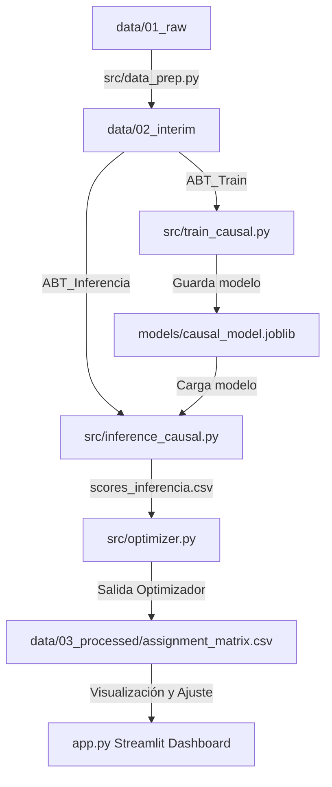

# Motor Causal y Optimización de Cobranzas (Next Best Action - NBA)

Este proyecto implementa la arquitectura base para un motor de cobranza inteligente enfocado en **Next Best Action (NBA)** para Mibanco. Combina modelos de inferencia causal y programación lineal entera para determinar de manera óptima el canal y momento del día más efectivo para contactar a cada cliente bajo morosidad.

---

## Arquitectura y Flujo de la Solución

El flujo del pipeline está estructurado en tres fases modulares y limpias:



### 1. Fase A: Preparación de Datos (`src/data_prep.py`)
- **Objetivo**: Integrar las 3 fuentes de datos entregadas por Mibanco (Clientes, Créditos y Contactos históricos).
- **Procesamiento**:
  - Clasifica los momentos de contacto (`hora_contacto`) en 3 bloques de horario comercial: **Mañana**, **Tarde** y **Noche**.
  - Genera combinaciones de tratamiento compuesto a nivel de interacción (ej. `sms_Mañana`, `whatsapp_Tarde`, `llamada_Mañana`, `campo_Tarde`).
  - Construye la tabla analítica de entrenamiento (`ABT_Train`) a nivel de contacto histórico con el outcome `pago_7d_post_contacto`.
  - Construye la tabla analítica para scoring (`ABT_Inferencia`) correspondiente al corte más reciente de créditos activos con deuda (mes `2026-03`).

### 2. Fase B: Modelo Causal e Inferencia (`src/train_causal.py` e `src/inference_causal.py`)
- **Objetivo**: Entrenar un modelo causal multi-tratamiento (T-Learner o similar) para predecir el impacto incremental (uplift) de cada canal/momento de contacto para cada cliente.
- **Salida de Inferencia**:
  - Estima la probabilidad de pago: $P(\text{pago} | \text{cliente}, \text{canal}, \text{momento})$.
  - Calcula el **Valor Neto Esperado (VNE)** de la acción:
    $$VNE = P(\text{pago}) \times \text{Monto Deuda} - \text{Costo del Canal}$$
  - Genera una matriz de scores (`scores_inferencia.csv`) con el VNE proyectado para cada alternativa de contacto por cliente.

### 3. Fase C: Optimización Lineal Entera con PuLP (`src/optimizer.py`)
- **Objetivo**: Resolver la asignación óptima de la campaña maximizando el retorno total bajo restricciones operativas reales del banco.
- **Modelo de Optimización**:
  - **Variables**: $x_{c, ch, m} \in \{0, 1\}$ (Asignación del cliente $c$ al canal $ch$ en momento $m$).
  - **Objetivo**: Maximizar el Valor Neto Esperado total de la campaña.
  - **Restricciones**:
    - *Exclusividad*: Máximo 1 contacto asignado por cliente.
    - *Presupuesto*: Costo total de llamadas, SMS y visitas físicas $\le$ Presupuesto asignado.
    - *Capacidad Operativa*: Límites en el número de gestiones telefónicas (call center) y visitas físicas de campo disponibles en el periodo.

---

## Ejecución del Pipeline

Para ejecutar el flujo completo una vez implementada la lógica interna de los módulos:

1. **Instalación de dependencias**:
   ```bash
   pip install -r requirements.txt
   ```

2. **Ejecución del pipeline en secuencia**:
   ```bash
   # Fase A: Preparación de datos
   python src/data_prep.py
   
   # Fase B: Entrenamiento causal
   python src/train_causal.py
   
   # Fase B: Inferencia/Scoring
   python src/inference_causal.py
   
   # Fase C: Optimización
   python src/optimizer.py
   ```

3. **Ejecución del Dashboard Interactivo**:
   ```bash
   streamlit run app.py
   ```

---

## Consideraciones para el Jurado Técnico

- **Modularidad**: Cada etapa está desacoplada mediante entradas/salidas en archivos locales intermedios (`data/02_interim/`), facilitando la depuración y mantenimiento independiente del modelo de Machine Learning y el modelo de Investigación de Operaciones.
- **Robustez**: Se define la arquitectura de un T-Learner para predecir múltiples tratamientos de manera robusta, evitando dependencias estrictas de compiladores C++ nativos en producción.
- **Escabilidad**: La optimización con PuLP puede configurarse con solvers externos comerciales (ej. Gurobi, CPLEX) o libres (CBC por defecto) si la escala de clientes crece por encima de las centenas de miles.

commit dev2