# README Técnico — NBA Cobranzas Mibanco
## IAthon Ulima · Reto Cobranzas

**Versión:** 2.0 · **Corte de cartera:** 2026-03 · **Scope:** mora temprana 1–30 días

---

## 1. Arquitectura General

```mermaid
flowchart LR
    A["Fase A\ndata_prep.py\nETL + ABTs"] --> B["Fase B.1\ntrain_causal.py\nT-Learner + IPW"]
    B --> C["Fase B.2\ninference_causal.py\nCATE Scores"]
    C --> D["Fase C\noptimizer.py\nMILP + Agenda\nRound-Robin"]

    subgraph RAW ["01_raw (Inputs)"]
        R1["01_Tabla_de_Clientes.csv\n50,000 filas"]
        R2["02_Tabla_de_Creditos.csv\nPanel mensual · 194,664 filas"]
        R3["03_Tabla_contactos.csv\n572,553 filas"]
    end

    subgraph INTERIM ["02_interim"]
        I1["ABT_Train.parquet"]
        I2["ABT_Inferencia.parquet"]
    end

    subgraph PROCESSED ["03_processed"]
        P1["cate_scores.parquet"]
        P2["asignacion_optimizada_*.csv"]
    end

    subgraph MODELS ["models/"]
        M1["uplift_model.joblib"]
    end

    RAW --> A
    A --> INTERIM
    INTERIM --> B
    B --> MODELS
    MODELS --> C
    INTERIM --> C
    C --> PROCESSED
    PROCESSED --> D
    RAW --> D
```



El sistema responde tres preguntas de negocio:

| Pregunta | Responsable | Mecanismo |
|---|---|---|
| **A quien contactar?** | `optimizer.py` (MILP) | Selecciona clientes con VNE > 0; el resto va a Control |
| **Por que canal?** | `optimizer.py` (MILP) | Maximiza VNE sujeto a presupuesto y capacidades |
| **Cuando?** | `optimizer.py` (Round-Robin) | Distribuye uniformemente en slots L-S 07:00-19:00 |

---

## 2. Fuentes de Datos

| Archivo | Sep | Filas | Cols | Descripcion |
|---|---|---|---|---|
| `01_Tabla_de_Clientes.csv` | `,` | 50,000 | 20 | Perfil del cliente: edad, genero, zona, riesgo, canales habilitados |
| `02_Tabla_de_Creditos.csv` | `,` | 194,664 | 17 | Panel mensual del credito: saldo, cuota, dias de mora, pago_realizado_mes |
| `03_Tabla_contactos.csv` | `;` | 572,553 | 31 | Historial de contactos: canal, hora, costo, respuesta, pago_7d_post_contacto |

### Estadisticas descriptivas clave

**01_Tabla_de_Clientes.csv** · 50,000 clientes unicos · 0% nulos en columnas criticas

| Columna | Nulos (%) | Notas |
|---|---|---|
| `score_riesgo` | 0.0% | Rango: entero aproximado [0, 850] |
| `prob_default` | 0.0% | Continua [0, 1] |
| `es_digital`, `uso_app` | 0.0% | Binarias (0/1) |
| `ratio_pago` | 0.0% | Proporcion de pagos historicos |

**02_Tabla_de_Creditos.csv** · Panel de 3 periodos: `2026-01`, `2026-02`, `2026-03` · 50,000 clientes unicos

| Columna | Nulos (%) |
|---|---|
| `dias_mora` | 0.0% |
| `saldo_restante` | 0.0% |
| `cuota_mensual` | 0.0% |
| `pago_realizado_mes` | 0.0% |

**03_Tabla_contactos.csv** · Rango: 2026-01-01 a 2026-03-31 · ~190,700 contactos/mes

| Metrica | Valor |
|---|---|
| Clientes unicos contactados | 32,728 / 50,000 (65.5%) |
| Tasa de pago global (7 dias) | 48.9% |
| Nulos en columnas criticas | 0.0% |

| Canal | Contactos historicos | % del total |
|---|---|---|
| llamada | 217,360 | 37.9% |
| whatsapp | 192,118 | 33.5% |
| sms | 127,157 | 22.2% |
| campo | 35,918 | 6.3% |

---

## 3. Variables del Modelo

### 3.1 Features de entrenamiento — `FEATURE_COLS` (27 variables)

| Grupo | Variables |
|---|---|
| **Perfil cliente** | `edad`, `score_riesgo`, `prob_default`, `num_atrasos_previos`, `dias_mora_promedio`, `ratio_pago`, `ultimo_pago_dias` |
| **Comportamiento digital** | `es_digital`, `uso_app`, `uso_whatsapp`, `interaccion_digital_score` |
| **Elegibilidad por canal** | `canal_whatsapp`, `canal_sms`, `canal_llamada`, `canal_campo` |
| **Snapshot del credito** | `dias_mora`, `saldo_restante`, `cuota_mensual`, `num_creditos_activos` |
| **Historial de contacto** | `num_contactos_ult7d`, `num_contactos_ult30d`, `dias_ultimo_contacto`, `intento_num`, `recency_score`, `days_since_due` |
| **Dummies derivadas** | `genero_M`, `zona_urbano`, `tipo_cliente_recurrente` |
| **Temporal** | `momento_contacto` (ordinal: 0=Manana, 1=Tarde, 2=Noche) |

### 3.2 Variable de tratamiento — `TREATMENT_MAP`

| Codigo | Canal |
|---|---|
| `T = 0` | Control (sin contacto — grupo sintetico) |
| `T = 1` | WhatsApp |
| `T = 2` | SMS |
| `T = 3` | Llamada |
| `T = 4` | Campo (visita presencial) |

### 3.3 Variable objetivo (Target)

`pago_7d_post_contacto` — binaria (0/1): pago realizado en los 7 dias posteriores al contacto.

### 3.4 Imputaciones en inferencia — `INFERENCE_DEFAULTS`

Los clientes de la ABT_Inferencia aun no han sido contactados en el periodo de scoring.
Las siguientes features de historial se imputan con valores facticos o neutros:

| Feature | Valor imputado | Justificacion |
|---|---|---|
| `num_contactos_ult7d` | `0` | No han sido contactados aun |
| `num_contactos_ult30d` | `0` | Idem |
| `dias_ultimo_contacto` | `999` | Valor centinela: sin contacto previo |
| `intento_num` | `0` | Primer intento futuro |
| `recency_score` | `0.0` | Sin historial de respuesta |
| `days_since_due` | `dias_mora` del credito | Valor factico disponible |
| **`momento_contacto`** | **`1` (Tarde)** | **Valor neutro — DESAJUSTE CONOCIDO** |

> **ADVERTENCIA — Desajuste de `momento_contacto`:** El modelo predice los CATEs
> asumiendo que todos los clientes seran contactados en horario "Tarde" (codigo 1).
> Sin embargo, la agenda Round-Robin posterior les asigna horarios reales distintos
> (07:00-18:00). Los clientes agendados en horario "Manana" (07:00-11:00) tienen
> un CATE calculado bajo un supuesto incorrecto.
>
> Si `momento_contacto` tiene poder predictivo en el modelo entrenado, este desajuste
> introduce sesgo sistematico en los scores de inferencia para clientes de manana.
>
> **Solucion iterativa:** resolver el MILP → obtener horarios asignados →
> re-calcular CATE con `momento_contacto` real → re-resolver el MILP.

---

## 4. Fase A — ETL (`data_prep.py`)

### Flujo de transformacion

```
load_raw_data()
├── df_clientes  (CSV sep=,)
├── df_creditos  (CSV sep=,) --> parse fecha_corte, fecha_pago
└── df_contactos (CSV sep=;) --> parse fecha DD/MM/YYYY

engineer_client_features(df_clientes)
└── Crea: genero_M | zona_urbano | tipo_cliente_recurrente

build_abt_train()
├── build_treated_rows()             [T = 1..4: contactos reales]
│   ├── momento_contacto = extract_moment(hora_contacto)
│   │   [0=Manana 06-12h | 1=Tarde 12-18h | 2=Noche resto]
│   ├── canal_contacto --> TREATMENT_MAP --> int
│   ├── Deuda_Expuesta = cuota_mensual
│   └── LEFT JOIN con df_clientes_feat
│
└── build_control_rows()             [T = 0: control sintetico]
    ├── Anti-join: (cliente_id, credito_id, periodo) SIN contacto
    ├── T=0, target = pago_realizado_mes
    └── Imputa features de contacto con INFERENCE_DEFAULTS

ABT_Train = concat(treated, control) --> 02_interim/ABT_Train.parquet

build_abt_inferencia()
├── Filtra periodo == "2026-03"
├── Filtra dias_mora en [1, 30]
├── Agrega a nivel cliente_id (sum cuota, max dias_mora)
└── Imputa INFERENCE_DEFAULTS --> 02_interim/ABT_Inferencia.parquet
    13,323 clientes unicos con mora 1-30 dias en 2026-03
```

### Construccion del Grupo Control Sintetico

El dataset de contactos es puramente observacional: no existe un grupo de clientes
asignado aleatoriamente a "no recibir contacto". Para entrenar un modelo causal que
compare contacto vs. no contacto, se fabrica el grupo control:

**Definicion:** Una fila de control es cualquier par `(cliente_id, credito_id, periodo)`
que aparece en la tabla de creditos pero **no tiene ningun contacto registrado**
en la tabla de contactos para ese mismo mes.

**Outcome del control:** Se usa `pago_realizado_mes` como proxy del comportamiento
natural de pago sin intervencion. Es un **proxy**, no una medicion directa, porque:

1. `pago_realizado_mes` mide si el cliente pago en algun momento del mes.
   `pago_7d_post_contacto` (del grupo tratado) mide una ventana de 7 dias.
   Las escalas temporales son distintas.
2. Un cliente puede pagar en el mes pero despues del dia 7 posterior al no-contacto;
   el proxy lo registra como pago, sesgando la tasa de conversion del control hacia
   arriba.

**Limitacion de sesgo de seleccion:** La ausencia de contacto no fue aleatoria.
Los asesores tendian a no contactar a clientes que estimaban de bajo riesgo de
impago. El grupo control sintetico puede tener una tasa de pago naturalmente mas alta
no porque la ausencia de contacto sea beneficiosa, sino porque es una seleccion de
buenos pagadores.

IPW mitiga este sesgo al re-ponderar las observaciones segun
$w_i = 1/\hat{P}(T_i | X_i)$, pero solo puede corregir el sesgo atribuible a
**variables observadas en el dataset**. Si existen confundidores no observados
(informacion verbal del asesor, relaciones previas, comportamiento reciente fuera
del sistema), el sesgo persiste.

---

## 5. Fase B.1 — Entrenamiento Causal (`train_causal.py`)

### Modelo: `CustomTLearner` con IPW

El T-Learner es un meta-learner de inferencia causal que entrena **un modelo de
regresion independiente por cada valor del tratamiento** y estima el efecto causal
individual (CATE) como diferencia de predicciones.

### CATE Individual

$$\hat{\tau}_k(x_i) = \hat{f}_k(x_i) - \hat{f}_0(x_i)$$

donde $\hat{f}_k$ es el `LGBMRegressor` entrenado con observaciones del canal $k$,
y $\hat{f}_0$ es el modelo del grupo control.

En palabras: **la probabilidad incremental de pago si se contacta al cliente $i$
por el canal $k$, comparado con no contactarlo en absoluto.**

### Mecanica de IPW (Inverse Probability Weighting)

```
Problema:  los asesores no asignaban canales aleatoriamente.
           El historial refleja sus sesgos de seleccion.
Solucion:  re-ponderar cada observacion por la inversa de su
           probabilidad de haber sido tratada (Propensity Score).

Pseudocodigo:

1. Binarizar tratamiento:
      T_bin = (T > 0).astype(int)
      [1=cualquier canal activo, 0=control]

2. Entrenar LGBMClassifier(X_train, T_bin):
      P_hat = P(T_activo=1 | X)

3. Clipear propensidades para estabilidad numerica:
      P_hat = clip(P_hat, 0.05, 0.95)
      [Evita pesos w --> inf cuando P_hat --> 0,
       i.e., observaciones casi nunca tratadas que
       recibirian peso explosivo >= 20x]

4. Calcular peso por observacion:
      w_i = 1.0 / P_hat(T_i | X_i)
      [Mayor peso a perfiles sub-representados
       historicamente en ese canal]

5. Entrenar LGBMRegressor por canal:
      model_k.fit(X_canal, Y_canal, sample_weight=w_canal)
```

> **Por que se clipea en [0.05, 0.95]:** Si un perfil fue contactado con
> probabilidad historica P_hat = 0.01, su peso seria w = 100, dominando el
> gradiente del arbol de decision. El clip limita el peso maximo a 20x y
> el minimo a ~1.05x.

### Hiperparametros del LGBMRegressor base (por canal)

| Parametro | Valor |
|---|---|
| `n_estimators` | 300 |
| `max_depth` | 6 |
| `learning_rate` | 0.05 |
| `num_leaves` | 31 |
| `min_child_samples` | 20 |
| `subsample` | 0.8 |
| `colsample_bytree` | 0.8 |
| `random_state` | 42 |

Split de evaluacion: estratificado 80/20 por `T` (`TEST_SIZE=0.20`, `RANDOM_STATE=42`).

### Metricas de evaluacion

| Metrica | Canal | Valor |
|---|---|---|
| ATE (Average Treatment Effect) | WhatsApp | **[VERIFICAR]** |
| ATE | SMS | **[VERIFICAR]** |
| ATE | Llamada | **[VERIFICAR]** |
| ATE | Campo | **[VERIFICAR]** |
| Coeficiente Qini / AUUC | Canal con mayor ATE | **[VERIFICAR]** |

> Los valores de ATE y Qini se imprimen en consola al ejecutar `python src/train_causal.py`
> en la seccion "EVALUACION DEL MODELO CAUSAL EN TEST SET". No se encontraron logs
> persistidos de esta fase en el directorio `logs/`.

**Artefacto de salida:** `models/uplift_model.joblib` (instancia de `CustomTLearner`)

---

## 6. Fase B.2 — Inferencia (`inference_causal.py`)

Aplica el modelo entrenado a la cartera actual de mora temprana.

**Criterios de filtro (aplicados en `data_prep.py`):**
- Periodo: `PERIODO_INFERENCIA = "2026-03"`
- Mora: `DIAS_MORA_MIN = 1` a `DIAS_MORA_MAX = 30` dias
- Granularidad: un registro por `cliente_id` (si tiene multiples creditos en mora,
  se suma `cuota_mensual` y se toma `max(dias_mora)`)
- **Resultado: 13,323 clientes unicos**

Para cada cliente $i$, el script calcula:

$$\hat{\tau}_k(x_i) = \hat{f}_k(x_i) - \hat{f}_0(x_i), \quad k \in \{1, 2, 3, 4\}$$

### Distribucion de CATEs por canal (de `cate_scores.parquet`)

| Canal | Media CATE | Std | Min | Max | % clientes CATE > 0 |
|---|---|---|---|---|---|
| WhatsApp | +0.3103 | 0.1335 | -0.5702 | +0.7813 | **96.7%** |
| SMS | +0.2325 | 0.1361 | -0.6940 | +0.7013 | **94.7%** |
| Llamada | +0.2552 | 0.1264 | -0.5498 | +0.6677 | **95.7%** |
| Campo | +0.2989 | 0.1392 | -0.5329 | +0.8862 | **96.6%** |

### Estadisticas de Deuda_Expuesta (S/ cuota mensual en mora)

| Metrica | Valor |
|---|---|
| Media | S/ 594.56 |
| Mediana | S/ 545.22 |
| Minimo | S/ 16.84 |
| Maximo | S/ 2,883.88 |
| **Total expuesto** | **S/ 7,921,300.32** |

**Artefacto de salida:** `data/03_processed/cate_scores.parquet`

Schema: `Cliente_ID | Deuda_Expuesta | Uplift_WhatsApp | Uplift_SMS | Uplift_Llamada | Uplift_Campo | Region | Zona`

---

## 7. Fase C — Optimizador (`optimizer.py`)

### 7.1 Extraccion de Parametros Data-Driven

`extract_dynamic_parameters()` aprende sus propios parametros del historico de contactos:

| Parametro | Metodo de calculo | Valor ejecutado |
|---|---|---|
| Costos unitarios | `max(costo_contacto)` por canal | WA=S/0.10 · SMS=S/0.20 · Llamada=S/1.50 · Campo=S/8.00 |
| Presupuesto diario $B$ | `mean(gasto_diario_ult_mes) x 0.85` | **S/ 6,024.58** (-15% sobre S/ 7,087.75) |
| Capacidad diaria por canal | Percentil 95 de contactos/dia | Llamada=2,659 · WA=2,327 · SMS=1,542 · Campo=453 |
| Capacidad horaria | P95 de atenciones en 1 hora | Llamada/Campo=299 · Digital=374 |
| Asesores de campo | `ceil(P95_visitas_region / 15)` | Lima=8 · Norte=8 · Sur=8 · Centro=9 |

### 7.2 Planteamiento Matematico MILP

#### Conjuntos e indices

| Simbolo | Descripcion |
|---|---|
| $\mathcal{C}$ | Conjunto de clientes · $\|\mathcal{C}\| = 13{,}323$ |
| $\mathcal{K}$ | Canales: $\{Control, WhatsApp, SMS, Llamada, Campo\}$ |
| $i \in \mathcal{C}$ | Indice de cliente |
| $k \in \mathcal{K}$ | Indice de canal |

#### Variables de decision

$$x_{i,k} \in \{0, 1\}, \quad \forall\, i \in \mathcal{C},\; k \in \mathcal{K}$$

$x_{i,k} = 1$ si y solo si se asigna el canal $k$ al cliente $i$.

#### Parametros

| Simbolo | Definicion |
|---|---|
| $\hat{\tau}_{i,k}$ | CATE del cliente $i$ para el canal $k$ (uplift predicho) |
| $d_i$ | Deuda expuesta del cliente $i$ (suma de cuotas en mora, S/) |
| $c_k$ | Costo unitario del canal $k$ (S/, inferido del historico) |
| $B$ | Presupuesto diario total: $B = 6{,}024.58$ S/ |
| $\text{Cap}_k$ | Capacidad diaria maxima del canal $k$ (P95 historico) |

#### Valor Neto Esperado (VNE)

$$VNE_{i,k} = \hat{\tau}_{i,k} \cdot d_i - c_k$$

Retorno economico incremental esperado de contactar al cliente $i$ por el canal $k$,
descontando el costo operativo de la accion.

#### Funcion objetivo

$$\max \sum_{i \in \mathcal{C}} \sum_{k \in \mathcal{K}} VNE_{i,k} \cdot x_{i,k}$$

#### Restricciones

**R1 — Unicidad** (exactamente 1 accion por cliente):

$$\sum_{k \in \mathcal{K}} x_{i,k} = 1, \quad \forall\, i \in \mathcal{C}$$

**R2 — Presupuesto diario:**

$$\sum_{i \in \mathcal{C}} \sum_{k \in \mathcal{K}} c_k \cdot x_{i,k} \leq B = 6{,}024.58$$

**R3 — Capacidades operativas por canal:**

$$\sum_{i} x_{i,\text{Llamada}} \leq 2{,}659 \qquad \sum_{i} x_{i,\text{Campo}} \leq 453$$

$$\sum_{i} x_{i,\text{WhatsApp}} \leq 2{,}327 \qquad \sum_{i} x_{i,\text{SMS}} \leq 1{,}542$$

**Solver:** CBC (COIN-OR Branch and Cut) · `gapRel=0.01` · `threads=4`

### 7.3 Agenda Operativa — Round-Robin

Una vez resuelto el MILP (que canal), la segunda etapa determina **cuando**:

**Algoritmo:**

1. Los clientes de cada canal se ordenan por $VNE_{i,k}$ descendente. Mayor prioridad
   recibe los slots mas tempranos de la semana.

2. Se genera `itertools.cycle` sobre slots `(dia, hora)` en orden natural:
   Lunes -> Sabado, 07:00 -> 18:00. El sabado es exclusivo para canales digitales
   (WhatsApp, SMS); Llamada y Campo solo L-V.

3. El primer cliente de mayor VNE va al slot (Lunes, 07:00), el siguiente a
   (Lunes, 08:00), etc. El ciclo avanza slot a slot a lo largo de toda la semana.

4. Si un slot alcanza su capacidad horaria (`llamada_por_hora=299` o
   `digital_por_hora=374`), el ciclo lo salta hasta encontrar uno con capacidad.

5. **Campo:** los asesores se asignan por region. El ciclo itera primero sobre
   asesores antes que sobre dias (`asesor_1 -> L,M,X,J,V`, luego `asesor_2 -> L,...`),
   distribuyendo visitas equitativamente entre dias antes de saturar el Lunes.

**Distribucion resultante (ejecucion 2026-06-23):**

```
Canal       Lunes  Martes  Miercoles  Jueves  Viernes  Sabado  TOTAL
-------------------------------------------------------------------
WhatsApp      388     385        372     396      389     397   2,327
SMS           260     263        276     252      252     239   1,542
Llamada       540     535        528     528      528       0   2,659
Campo          60      60         50      16        0       0     186
-------------------------------------------------------------------
TOTAL       1,248   1,243      1,226   1,192    1,169     636   6,714
```

Pico maximo: 54 contactos digitales/hora y 45 llamadas/hora (carga plana, sin
concentracion en las 10:00 AM del modelo anterior).

---

## 8. Outputs del Pipeline

### Distribucion final por canal

| Canal | Clientes | % total | Costo unitario | Costo total | VNE total |
|---|---|---|---|---|---|
| WhatsApp | 2,327 | 17.47% | S/ 0.10 | S/ 232.70 | S/ 824,385.87 |
| SMS | 1,542 | 11.57% | S/ 0.20 | S/ 308.40 | S/ 392,258.80 |
| Llamada | 2,659 | 19.96% | S/ 1.50 | S/ 3,988.50 | S/ 687,533.57 |
| Campo | 186 | 1.40% | S/ 8.00 | S/ 1,488.00 | S/ 138,891.79 |
| Control | 6,609 | 49.61% | S/ 0.00 | S/ 0.00 | S/ 0.00 |
| **TOTAL** | **13,323** | **100%** | — | **S/ 6,017.60** | **S/ 2,043,070.03** |

Verificacion: $232.70 + 308.40 + 3{,}988.50 + 1{,}488.00 = S/\,6{,}017.60$ ✓
Dentro del presupuesto de $B = S/\,6{,}024.58$ (uso del 99.88%).

### KPIs del sistema

| Metrica | Valor |
|---|---|
| Clientes evaluados | 13,323 |
| Clientes contactados | 6,714 (50.39%) |
| Clientes en Control (*Sleeping Dogs*) | 6,609 (49.61%) |
| Deuda total expuesta | S/ 7,921,300.32 |
| Presupuesto disponible | S/ 6,024.58 |
| Presupuesto consumido | S/ 6,017.60 (99.88%) |
| VNE total esperado | S/ 2,043,070.03 |
| ROI multiplicador | 339.52x |
| VNE baseline aleatorio | S/ 327,745.08 |
| **Valor agregado vs. azar** | **S/ 1,715,324.95 (6.2x mas)** |

### Nota sobre el ROI de 339x

El ROI de 339x es una **metrica relativa de eficiencia del sistema**: representa el
valor neto esperado total dividido por el presupuesto de contacto
($S/\,2{,}043{,}070 \div S/\,6{,}018$). **No es una promesa financiera absoluta** —
asume que el modelo causal es correcto y que los CATEs predichos se materializan
exactamente.

Su utilidad real es **comparativa**: mide si la asignacion optimizada supera a una
asignacion aleatoria (baseline S/ 327,745) o a reglas fijas. La diferencia de **6.2x**
entre el VNE del sistema y el del azar es la metrica operacionalmente relevante.

---

## 9. Limitaciones Conocidas y Trabajo Futuro

### Limitaciones actuales (priorizadas por impacto)

**[ALTO] Grupo control sintetico no aleatorio.**
La ausencia de contacto no fue una decision aleatoria: los asesores no contactaban
a clientes que estimaban pagarian solos. El grupo control sobrerepresenta buenos
pagadores, sesgando el CATE hacia arriba. IPW mitiga el sesgo **solo para variables
observadas**. Si existen confundidores no observados (informacion informal del asesor,
relaciones previas), el sesgo persiste.

*Solucion ideal:* disenar un A/B test controlado por cohorte con asignacion aleatoria
real a "no contactar" durante al menos 4 semanas.

**[ALTO] `momento_contacto` imputado en inferencia.**
Todos los CATEs de inferencia se calculan con `momento_contacto = 1` (Tarde), pero
la agenda Round-Robin asigna horarios reales distintos. Los clientes agendados a las
07:00 (Manana) tienen un CATE calculado bajo supuesto incorrecto.

*Solucion:* ciclo de re-scoring — resolver MILP → obtener horarios asignados →
re-calcular CATE con `momento_contacto` real → re-resolver el MILP.

**[MEDIO] CATE de Campo posiblemente sobreestimado.**
Campo representa solo el 6.3% de contactos historicos (35,918 / 572,553). Con pocas
observaciones, el LGBMRegressor de Campo puede sobreajustar. El CATE medio de Campo
(0.299) es comparable al de WhatsApp (0.310) pero con mayor varianza (std=0.139 vs
0.134) y el rango maximo mas alto (+0.886 vs +0.781).

*Solucion:* bootstrap del CATE para obtener intervalos de confianza por canal y
detectar sobreajuste en grupos poco representados.

**[MEDIO] Sin restricciones regulatorias.**
El MILP no incluye: listas de exclusion SBS/ASBANC, franjas horarias bloqueadas por
normativa de cobranza telefonica, maximo de intentos de contacto por cliente por mes,
bloqueo de clientes con promesa de pago activa. En produccion, estas restricciones
son tan criticas como las de capacidad.

**[BAJO] ROI de 339x sin intervalo de confianza.**
Es una estimacion puntual sin bootstrapping del pipeline completo. Debe reportarse
como metrica relativa vs. baseline aleatorio, no como cifra absoluta.

### Proximas iteraciones

- Agregar restriccion $\sum_k x_{i,k} \leq N$ por cliente por mes al MILP (R4).
- Feedback loop: actualizar pesos IPW con resultados reales de la semana anterior.
- Explorar `CausalForest` (EconML) para obtener intervalos de confianza nativos
  del CATE y mayor heterogeneidad de tratamiento.
- Implementar el ciclo de re-scoring de `momento_contacto` descrito en limitacion 2.
- Persistir logs de evaluacion de `train_causal.py` para auditabilidad del ATE y Qini.

---

## 10. Reproducibilidad

### Versiones de dependencias

| Libreria | Version minima | Version instalada |
|---|---|---|
| `lightgbm` | >=4.0.0 | **4.6.0** |
| `pulp` | >=2.7.0 | **3.3.2** |
| `scikit-learn` | >=1.2.0 | **1.6.1** |
| `pandas` | >=2.0.0 | **3.0.3** |
| `joblib` | >=1.3.0 | **1.5.3** |
| `pyarrow` | >=14.0.0 | **24.0.0** |
| `numpy` | >=1.24.0 | **[VERIFICAR]** |
| `econml` | >=0.15.0 | No usado en runtime — `CustomTLearner` reemplaza la dependencia de EconML |

### Ejecucion completa del pipeline

```bash
# 1. Instalar dependencias
pip install -r requirements.txt

# 2. Fase A: ETL y construccion de ABTs
python src/data_prep.py

# 3. Fase B.1: Entrenamiento del modelo causal
python src/train_causal.py

# 4. Fase B.2: Inferencia CATE sobre cartera actual
python src/inference_causal.py

# 5. Fase C: Optimizacion MILP + Agenda Round-Robin
python src/optimizer.py

# (Opcional) Dashboard interactivo
streamlit run app.py
```

### Tiempos de ejecucion aproximados

| Fase | Script | Tiempo aproximado |
|---|---|---|
| A — ETL | `data_prep.py` | **[VERIFICAR]** |
| B.1 — Entrenamiento | `train_causal.py` | **[VERIFICAR]** |
| B.2 — Inferencia | `inference_causal.py` | **[VERIFICAR]** |
| C — Optimizacion | `optimizer.py` | ~90 segundos (carga CSV + MILP + agenda) |

> No se encontraron logs temporales persistidos en `logs/`. Para medir tiempos,
> ejecutar `time python src/<script>.py` en bash o `Measure-Command` en PowerShell.

### Semilla de aleatoriedad

`RANDOM_STATE = 42` — definida en `src/config.py` y usada consistentemente en:

- `train_test_split()` (Fase B.1, split 80/20 estratificado por T)
- `LGBMClassifier` del propensity score model (IPW)
- `LGBMRegressor` de cada canal del T-Learner (5 modelos independientes)

---

*Documento generado a partir del codigo fuente verificado — 2026-06-23.*
*Valores marcados con **[VERIFICAR]** requieren ejecucion del pipeline o revision manual del log de salida.*
